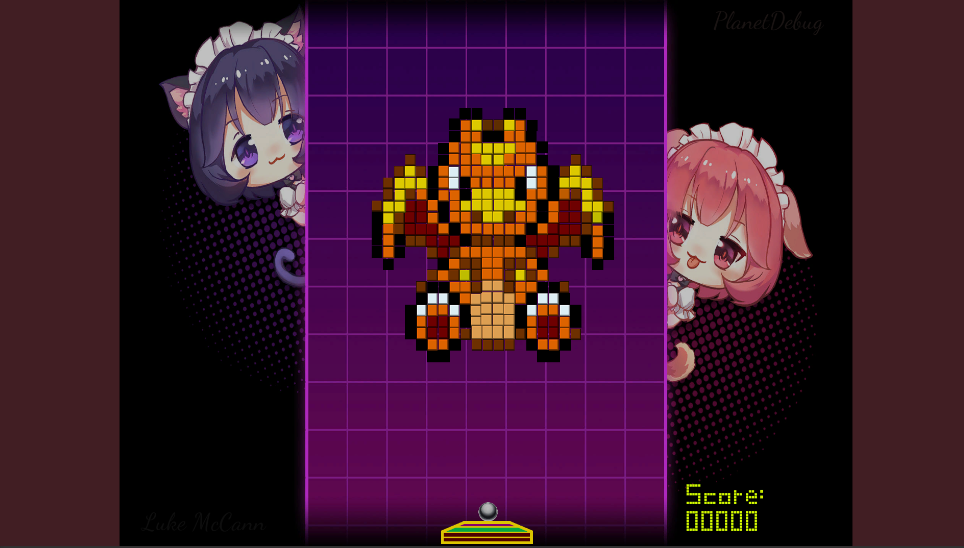

# Bloc-Breaker 

## Author: Luke McCann

## The University of Huddersfield

## Genre: Block Breaking Game

## Theme: Anime

Original take on a classic block-breaking game. Anime-themed block breaker, to play 
[click here](https://404NotFound)

If the link does not work check the repository, if there is no index.html the project requires building.

Alternatively, you may clone this repository and double click the index.html file or drag index.html into your browser. 

### Developer Tools / Review Tools

In this version review tools are left active to enable you to play through and experience each level. Please leave me a note if any levels appear to difficult.

There are 7 levels currently, to switch level press "1 - 9" atop the keyboard to see the respective level. 

### Game

A fast-paced anime-themed Arkanoid style block-buster!

The game offers a variety of levels, including "boss levels" in which the player can gain massive points by destroying a "Bloc-Art" image of popular anime characters.

#### Current Boss Levels:

#### Normal Play

#### Menus

#### Liscences and Accreditations

Font Liscence: 
The FontStruction “blocks”
(http://fontstruct.com/fontstructions/show/606699) by “samhorne2” is
licensed under a Creative Commons Attribution Share Alike license
(http://creativecommons.org/licenses/by-sa/3.0/).

Assets provided by GameDev.TV:
https://www.gamedev.tv/